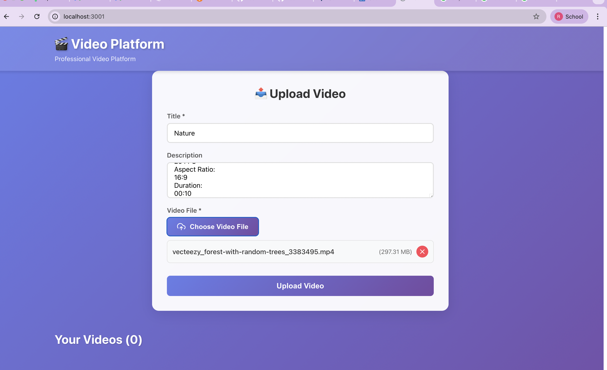
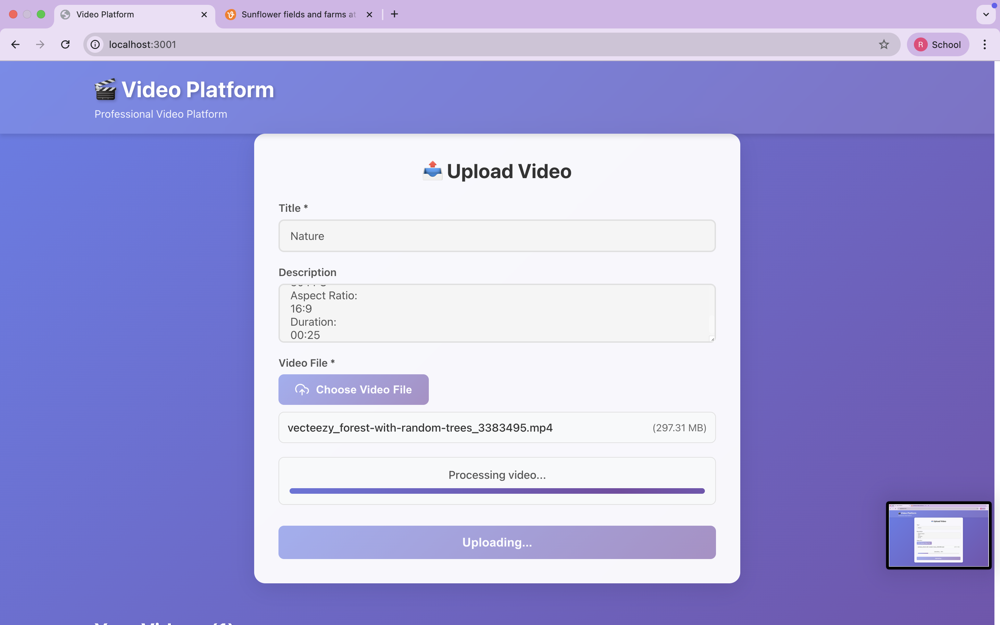
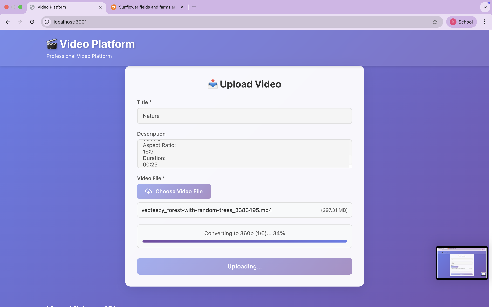
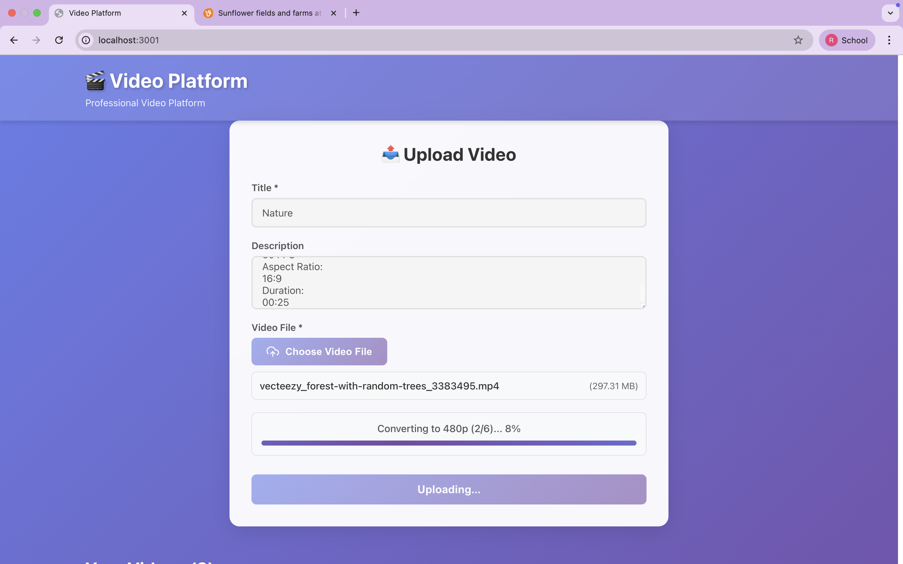
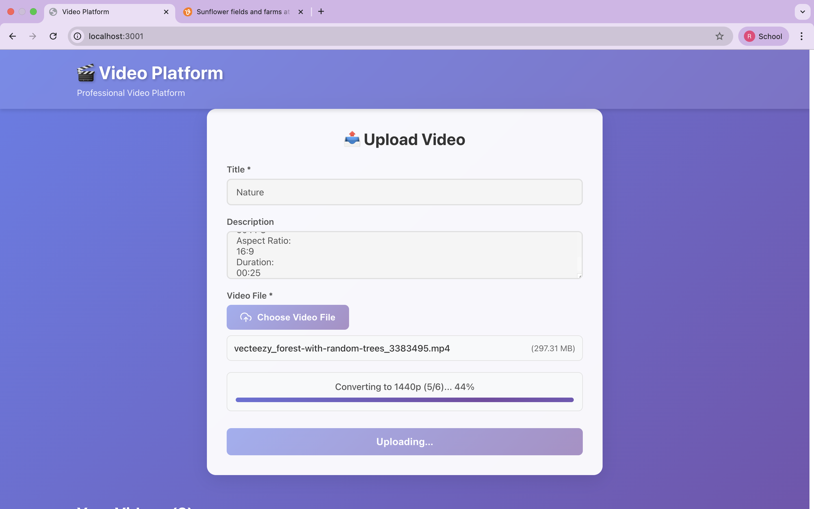
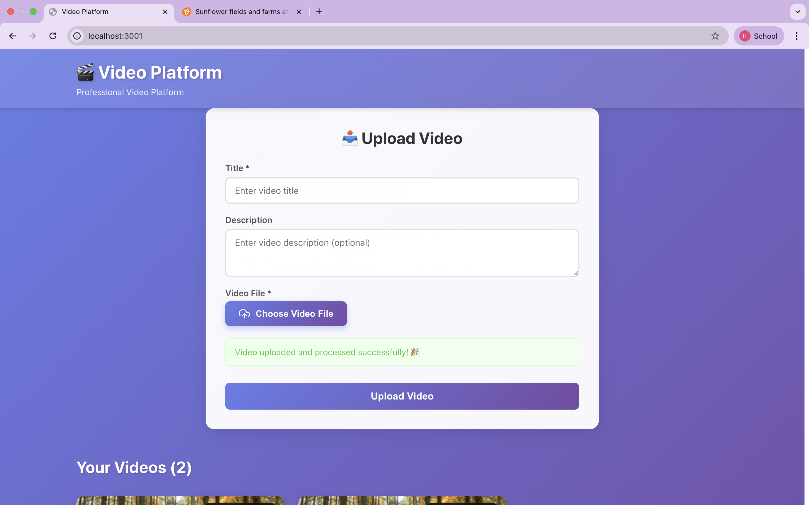

# Video Platform

A professional full-stack video upload and streaming platform built with React and Node.js. Upload large video files, automatically generate thumbnails, convert to multiple resolutions, and stream with a custom video player.

---

## Key Features

- Upload videos up to 5GB with real-time progress tracking
- Automatic multi-resolution conversion (360p to 4K)
- Auto-generated thumbnails from your videos
- Custom video player with speed control, resolution switching, fullscreen
- Modern, responsive UI with beautiful animations
- Real-time processing status updates

---

## Quick Start

### Prerequisites

- Node.js (v14+)
- npm
- FFmpeg ([installation guide](DOCUMENTATION.md#ffmpeg-installation))

### Installation

```bash
# Install backend dependencies
npm install

# Install frontend dependencies
cd frontend
npm install
cd ..
```

### Run the Application

**Terminal 1 - Backend:**
```bash
PORT=9876 npm run dev
```

**Terminal 2 - Frontend:**
```bash
cd frontend
npm start
```

Open **http://localhost:3000** in your browser.

---

## Screenshots


















---

## Technology Stack

**Backend:** Node.js, Express, Multer, FFmpeg  
**Frontend:** React 18, Axios, React Icons  
**Video Processing:** FFmpeg with fluent-ffmpeg

---

## Usage

1. **Upload**: Click "Choose Video File", add title/description, and upload
2. **Processing**: Wait for automatic thumbnail generation and multi-resolution conversion
3. **Play**: Click any video thumbnail to open the custom player
4. **Controls**: 
   - Space - Play/Pause
   - F - Fullscreen
   - M - Mute/Unmute
   - Arrows - Seek 5 seconds

---

## Configuration

Default port: `9876` (backend) and `3000` (frontend)

To change ports, create a `.env` file:
```
PORT=9876
NODE_ENV=development
```

---

## Common Issues

**FFmpeg not found?**  
Install FFmpeg: `brew install ffmpeg` (Mac) or see [docs](DOCUMENTATION.md#troubleshooting)

**Port already in use?**  
Change port in `.env` or kill the process: `lsof -ti:9876 | xargs kill -9`

**Videos not processing?**  
Check backend console for errors and verify FFmpeg installation: `ffmpeg -version`

---

## Project Structure

```
Video Platform Assignment/
├── backend/
│   ├── server.js              # Express server
│   ├── routes/                # API endpoints
│   ├── utils/                 # Video processing
│   └── uploads/               # Video storage
└── frontend/
    └── src/
        ├── App.js             # Main component
        └── components/        # React components
```

---

## Documentation

For detailed documentation, see [DOCUMENTATION.md](DOCUMENTATION.md):
- API Reference
- Configuration Options
- Troubleshooting Guide
- Architecture & Design Decisions
- Development Notes

---

## Design Decisions

- In-memory storage for simplicity (use database for production)
- Local file storage (use cloud storage for production)
- Immediate processing (use queue system for production)
- Smart resolution conversion - only generates up to source quality

---

## Future Enhancements

- User authentication
- Cloud storage (AWS S3)
- Video editing features
- Search & filtering
- Playlist creation
- HLS/DASH adaptive streaming

---

## AI-Assisted Development

This project was built with **Claude 4 Sonnet AI** through **Cursor IDE**, demonstrating modern AI-assisted development workflows. See [DOCUMENTATION.md](DOCUMENTATION.md#ai-assisted-development) for details.

---

**Built with React, Node.js, and FFmpeg**
